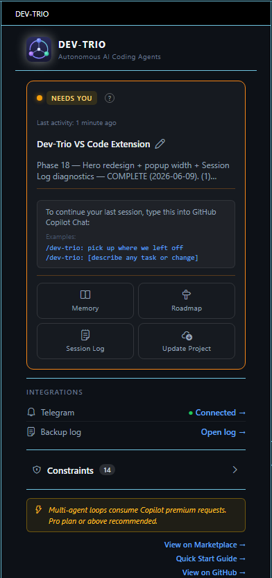
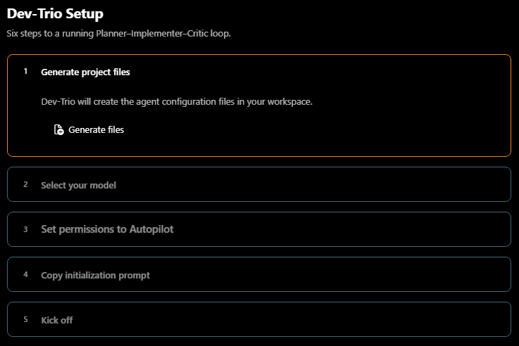
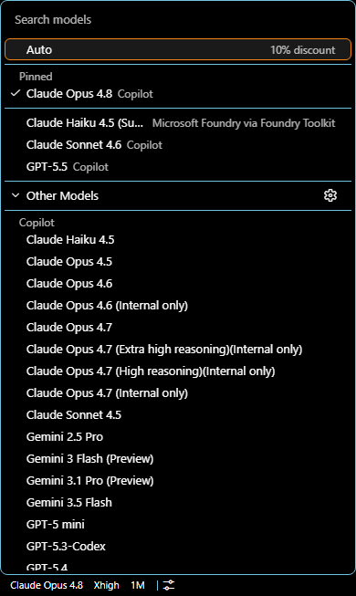
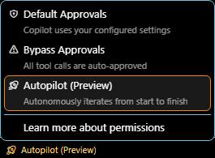
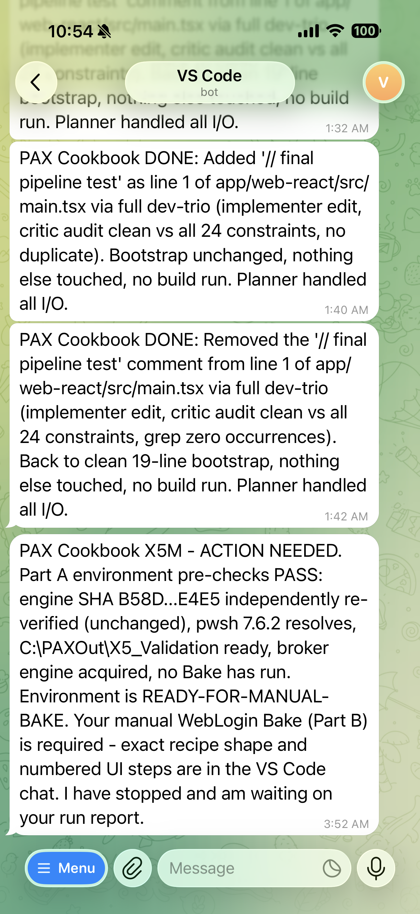

# Dev-Trio — Quick Start

**Get a self-checking AI development team working for you in about 10 minutes.**

Dev-Trio turns the AI coding assistant you already use into a small team that
plans the work, does the work, and double-checks the work — so you get more
reliable results with less back-and-forth.

---

## Before you begin

You'll need:

- **Visual Studio Code** (version 1.96 or newer) — the free code editor from Microsoft.
- **GitHub Copilot** — an active subscription (the Pro plan or higher is recommended).
  This is the AI service Dev-Trio coordinates.
- **A project folder** open in VS Code — new or existing, in any language.

That's it. Dev-Trio adds the structure; your AI assistant provides the intelligence.

---

## Step 1 — Install Dev-Trio

**Option 1 — VS Code Marketplace (coming soon).** Once the listing is live, you'll open VS Code, click the **Extensions** icon in the left toolbar, search for **Dev-Trio**, and click **Install**.

**Option 2 — Manual install (available now).** Download `dev-trio-1.1.0-marketplace.vsix` from the [Releases page](https://github.com/microsoft/Dev-Trio/releases), then install it:

- **VS Code:** Command Palette (`Ctrl+Shift+P` / `Cmd+Shift+P`) → **Extensions: Install from VSIX…** → pick the file.
- **Terminal:** `code --install-extension dev-trio-1.1.0-marketplace.vsix`

Once installed, open any project folder. The Dev-Trio setup guide opens automatically.



---

## Step 2 — Follow the setup guide

Click the **Dev-Trio** icon in the left toolbar, then **Get started**. A friendly,
step-by-step guide opens:



The guide walks you through everything. The key steps:

**Choose your AI assistants.** Dev-Trio works with three popular AI coding
assistants — **GitHub Copilot**, **Claude Code**, and **OpenAI Codex**. Pick the
one (or ones) you use. You can change this later.

**Pick a capable model.** In the Copilot chat box, choose a strong model — such as
Claude Opus, Claude Sonnet, or GPT-5 — for the best results.



**Turn on hands-free mode.** Set Copilot to **Autopilot** so the team can edit
files and run tasks without stopping to ask permission for every step.



**Send the start-up message.** The guide gives you a ready-made message to send to
your AI assistant. It tells the team to study your project and get organized. Send
it, and you're ready.

---

## Step 3 — Put the team to work

Start any task with a simple message:

```
/dev-trio: Add a sign-in page with email and password
```

From there, the team works on its own:

- The **Planner** figures out how to do the job and assigns the work.
- The **Implementer** makes the changes and tests them.
- The **Critic** reviews the work against your project's rules before it is accepted.

It keeps going until the task is done — or until it reaches a real decision that
needs you. You don't have to watch it work.

---

## Step 4 — Get notified when it's done (optional)

So you can step away during longer tasks, Dev-Trio can message you when the team
finishes or needs your input.

In the Dev-Trio panel, under **Integrations**, pick a service — **Telegram,
Microsoft Teams, Slack, Discord,** or a custom webhook — and follow the short setup.



---

## Step 5 — Review what happened

Open the **Session Log** in the Dev-Trio panel to see a clear history of every
task: what was planned, what was built, what the Critic flagged, and an estimate
of how many Copilot credits it used.

You can edit your project's goals and rules anytime from the **Memory** and
**Roadmap** editors in the panel — no special formatting needed. The team picks up
your changes on the next task automatically.

---

## Helpful to know

- **The guide didn't open?** Click the Dev-Trio icon in the left toolbar.
- **The team keeps pausing for permission?** Make sure Copilot is set to
  **Autopilot** mode (Step 2).
- **Results feel shaky?** Switch to a stronger model (Claude Opus or GPT-5) in the
  Copilot chat box.
- **Want to change which AI assistants you use?** Open **Update Project** in the
  Dev-Trio panel.

---

## Learn more

- [Full overview](../README.md)
- [GitHub repository](https://github.com/microsoft/Dev-Trio)
